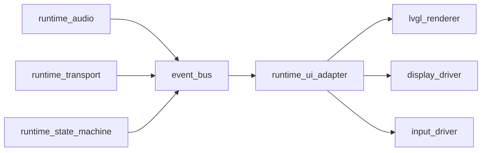

# LVGL Integration Spec (Hardware-First)

## 1. Objetivo

Integrar una capa de UI opcional con LVGL sin comprometer la prioridad del runtime de audio ni el alcance hardware-first del proyecto.

La UI debe actuar como consumidor de estado/eventos del dispositivo y nunca como owner del flujo principal.

## 2. Principios de diseno

1. Audio first: captura, reproduccion e interrupciones siempre tienen mayor prioridad que la UI.
2. UI desacoplada: LVGL no conoce detalles internos de audio/transporte, solo un contrato de eventos.
3. Headless parity: el runtime debe funcionar igual con UI apagada.
4. Fallo seguro: si la UI falla, el runtime de voz sigue operativo.
5. Portable HAL: drivers de pantalla y touch van por abstracciones, no hardcode.

## 3. Alcance

### In scope

1. Capa `runtime_ui` opcional.
2. Bus de eventos interno para estado de runtime.
3. Contrato de estado UI (lectura) y comandos UI (entrada local).
4. Integracion de transporte WebSocket para payload externo en tiempo real.
5. Integracion de tareas FreeRTOS para render sin bloquear audio.
6. Metrica de impacto de UI en latencia y estabilidad.

### Out of scope

1. Logica cloud/LLM en la UI.
2. Pantallas complejas con navegacion de alto costo.
3. Dependencia de proveedor externo para render.

## 4. Arquitectura propuesta

### Modulos

1. `runtime_state_machine`: fuente unica de estado.
2. `event_bus`: publica eventos inmutables con timestamp monotonic.
3. `runtime_ui_adapter`: traduce eventos a widgets/pantallas LVGL.
4. `display_driver`: backend de pantalla (SPI/RGB/etc).
5. `input_driver`: touch/botones/encoder.

## 5. Contrato de eventos (v1)

Eventos minimos obligatorios:

1. `BOOT_COMPLETED`
2. `SESSION_CONNECTED`
3. `SESSION_DISCONNECTED`
4. `LISTENING_STARTED`
5. `LISTENING_STOPPED`
6. `PLAYBACK_STARTED`
7. `PLAYBACK_STOPPED`
8. `INTERRUPTION_TRIGGERED`
9. `ERROR_RAISED`
10. `LATENCY_SAMPLE_RECORDED`

Campos base de cada evento:

1. `schema_version` (u16)
2. `event_type` (enum)
3. `event_id` (u32 monotonic)
4. `timestamp_ms` (u64 monotonic)
5. `session_id` (opcional)
6. `device_id` (seudonimo)
7. `payload` (estructura por tipo)

Reglas:

1. Eventos son append-only y ordenados por `event_id`.
2. Sin bloqueo: productor nunca espera a consumidor UI.
3. Si hay overflow, se descartan eventos no criticos y se emite `ERROR_RAISED`.

## 6. Transporte WebSocket (incluido)

El runtime incluye WebSocket como transporte primario del payload externo.

### 6.1 Flujo de conexion

1. `DISCONNECTED` -> abrir socket -> `CONNECTING`.
2. Handshake exitoso -> `CONNECTED` y emitir `SESSION_CONNECTED`.
3. Heartbeat periodico (`PING`/`PONG`) para validar sesion activa.
4. Ante timeout/error -> `RECONNECTING` con backoff exponencial.
5. Si excede maximo de reintentos -> `ERROR_RAISED` y modo degradado.

### 6.2 Requisitos de protocolo

1. Mensajes JSON o binarios deben incluir `schema_version`.
2. Validacion estricta de tamano maximo por mensaje.
3. Rechazo seguro de payload invalido sin bloquear tasks criticas.
4. Soporte de `session_id` y `device_id` seudonimo en cada intercambio.

### 6.3 Politica de reconexion

1. Backoff exponencial con jitter.
2. Estado local de voz nunca se bloquea por reconexion.
3. UI refleja estado de socket: disconnected/connecting/connected/reconnecting.

### 6.4 Observabilidad minima

1. `ws_connect_latency_ms`
2. `ws_reconnect_count`
3. `ws_last_disconnect_reason`
4. `ws_messages_dropped`

### 6.5 Servidor local de pruebas (obligatorio en desarrollo)

Para desarrollo y validacion offline, la implementacion debe considerar un servidor WebSocket local que permita simular el proveedor externo y enviar comandos al dispositivo.

Requisitos minimos del servidor local:

1. Correr en entorno local sin dependencias cloud.
2. Aceptar multiples clientes ESP32 simultaneos.
3. Enviar payloads de control (`CONNECT_ACK`, `PLAYBACK_START`, `PLAYBACK_STOP`, `INTERRUPT`, `PING`).
4. Inyectar condiciones de red (delay, jitter, desconexion, perdida de mensajes).
5. Registrar trazas de mensajes con timestamp para debug y replay.

Uso en flujo de desarrollo:

1. Firmware apunta a `ws://<host-local>:<port>` por configuracion.
2. QA ejecuta escenarios reproducibles desde scripts locales.
3. CI de integracion puede correr una version mock del servidor.

## 7. UI state contract (lectura)

Campos sugeridos para render:

1. `connection_state`: disconnected | connecting | connected
2. `voice_state`: idle | listening | speaking | interrupted | error
3. `vu_level`: 0..100
4. `last_turn_latency_ms`
5. `packet_drop_rate`
6. `firmware_version`
7. `uptime_s`

Comandos de entrada local permitidos (opcionales):

1. `MUTE_TOGGLE`
2. `PUSH_TO_TALK_START`
3. `PUSH_TO_TALK_STOP`
4. `RECONNECT_REQUEST`

## 8. FreeRTOS tasks y prioridades

Propuesta inicial (ajustable por target):

1. `task_audio_capture` prioridad 5
2. `task_audio_playback` prioridad 5
3. `task_websocket_io` prioridad 4
4. `task_transport_parser` prioridad 4
5. `task_ui_render` prioridad 2
6. `task_metrics` prioridad 1

Reglas de scheduling:

1. `task_ui_render` no bloquea mutex de audio.
2. Tick UI fijo (ej. 20-30 ms) con presupuesto de CPU.
3. Backpressure: si hay saturacion, reducir FPS antes de tocar audio.

## 9. Presupuesto de recursos (objetivo inicial)

1. RAM UI <= 25% de heap libre post-boot.
2. CPU UI <= 20% en carga nominal.
3. Latencia extra por UI en interrupcion <= +15 ms p95.
4. Boot time extra por UI <= +300 ms.

Estos valores son gate de performance y deben medirse por board.

## 10. Estrategia de pruebas

### Unit

1. Mapeo evento -> estado UI.
2. Reglas de prioridad de comandos UI.
3. Validacion de payloads de evento.

### Integracion

1. Event bus con alto throughput.
2. Coexistencia audio + UI sin bloqueos.
3. Recovery de UI tras fallo de display driver.
4. Handshake WebSocket + reconexion con backoff.
5. Heartbeat y deteccion de timeout de socket.
6. Compatibilidad con servidor WebSocket local de pruebas.
7. Inyeccion de comandos desde servidor local y validacion de respuesta del firmware.

### E2E

1. Flujo completo: connect -> listen -> playback -> interrupt.
2. Multi-ESP32 con arbitraje first-to-lock visible en UI.
3. Reconexion de sesion y continuidad de pantalla.
4. Perdida de WebSocket durante playback y recuperacion segura.
5. Flujo completo contra servidor local: connect -> comando -> playback -> interrupt.

### Performance

1. p50/p95/p99 de interrupcion con UI ON vs OFF.
2. FPS estable bajo carga.
3. Uso de heap y fragmentacion en 30+ min.
4. Impacto de latencia con WebSocket degradado.

## 11. Plan de implementacion por fases

### Fase 0: Preparacion

1. Definir headers de contrato (`ui_events.h`, `ui_state.h`).
2. Introducir `event_bus` sin LVGL real.
3. Definir interfaz `transport_ws.h`.
4. Instrumentar metricas base UI OFF.

### Fase 1: UI stub (sin display real)

1. `runtime_ui_adapter` con no-op renderer.
2. Cliente WebSocket minimo con reconnect + heartbeat.
3. Tests de contrato y stress de eventos.
4. Servidor local mock para pruebas de comandos y reconexion.

### Fase 2: LVGL minimo

1. Pantalla unica de estado + conectividad + VU.
2. Integrar `display_driver` y loop LVGL.
3. Integrar eventos de estado de WebSocket en UI.
4. Validar umbrales de latencia y CPU.

### Fase 3: Hardening

1. Manejo de errores de driver.
2. Degradacion controlada (bajar FPS / modo texto).
3. Pruebas largas de reconexion de red y ajustes por board.

## 12. Criterios de aceptacion

1. UI es opcional y no rompe modo headless.
2. Todas las pruebas de audio existentes siguen en verde.
3. Performance cumple presupuesto definido.
4. Contrato de eventos/documentacion actualizado.
5. No hay acoplamiento del core a servicios cloud.
6. WebSocket reconecta de forma estable bajo perdida de red.

## 13. Riesgos y mitigaciones

1. Riesgo: contention de CPU con audio.
   Mitigacion: prioridad inferior UI + limite de FPS + profiling continuo.
2. Riesgo: consumo de RAM excesivo.
   Mitigacion: pool fijo para widgets + budget gates en CI de firmware.
3. Riesgo: complejidad de drivers por pantalla.
   Mitigacion: HAL de display/input con implementaciones por board.
4. Riesgo: reconexion agresiva de WebSocket saturando CPU/red.
   Mitigacion: backoff con jitter, limite de reintentos y telemetria de socket.
